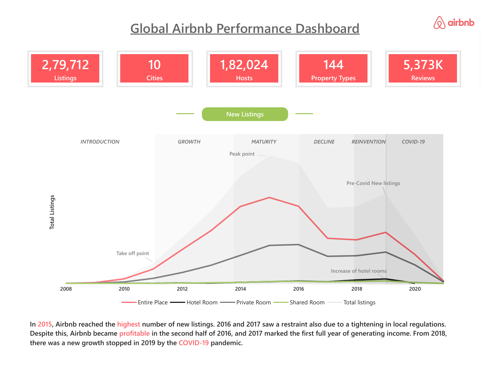
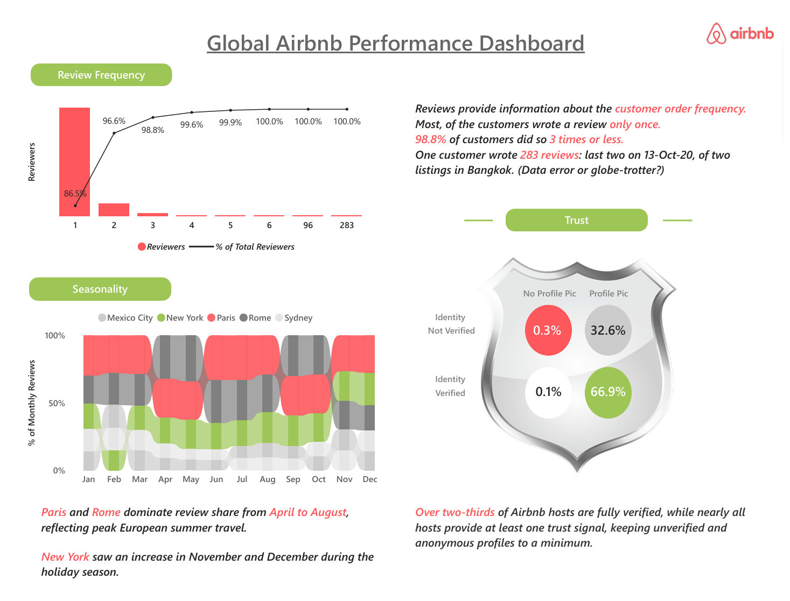

# Global Airbnb Real Estate Performance Dashboard

An interactive **Power BI dashboard** for analyzing real-estate market performance across major Airbnb markets.

## 🎯 Business Problem

Real-estate and property-market data can contain a large number of listings, properties, hosts, prices, reviews and performance indicators. Without a centralized analytical view, it can be difficult to:

- Compare property markets across different cities
- Understand differences in property types and pricing
- Identify changes in listing and market activity
- Evaluate property performance through ratings and reviews
- Identify seasonal patterns and market trends
- Assess host activity and trust indicators

## 💡 Solution

This dashboard transforms the underlying Airbnb listing and review data into an **interactive business intelligence solution**.

It provides a centralized view of key **property and market KPIs**, allowing users to explore performance by city, property type and time period.

The dashboard enables users to:

- Monitor listing growth and market development
- Compare **market share and average prices** across cities and property types
- Evaluate ratings and review performance
- Analyze **seasonality and review activity**
- Explore host verification and trust indicators
- Drill into detailed market-level performance

This allows complex real-estate data to be converted into **clear, actionable insights for market comparison and data-driven decision-making**.

## 📊 Key Analysis

- Listing Growth & Market Development
- Market Share & Pricing
- Property Type Performance
- Ratings & Reviews
- Seasonality
- Host Activity & Trust

## 🛠️ Tools

**Power BI | Power Query | DAX | Data Modeling | Data Visualization**

## 📂 Dataset

Airbnb Listings & Reviews dataset — Maven Analytics

https://mavenanalytics.io/data-playground/airbnb-listings-reviews

## 🖼️ Dashboards

## 👤 Author

**Komail Butt**

[LinkedIn](https://linkedin.com/in/komail-butt) · [Portfolio](https://komailbutt.github.io/)
