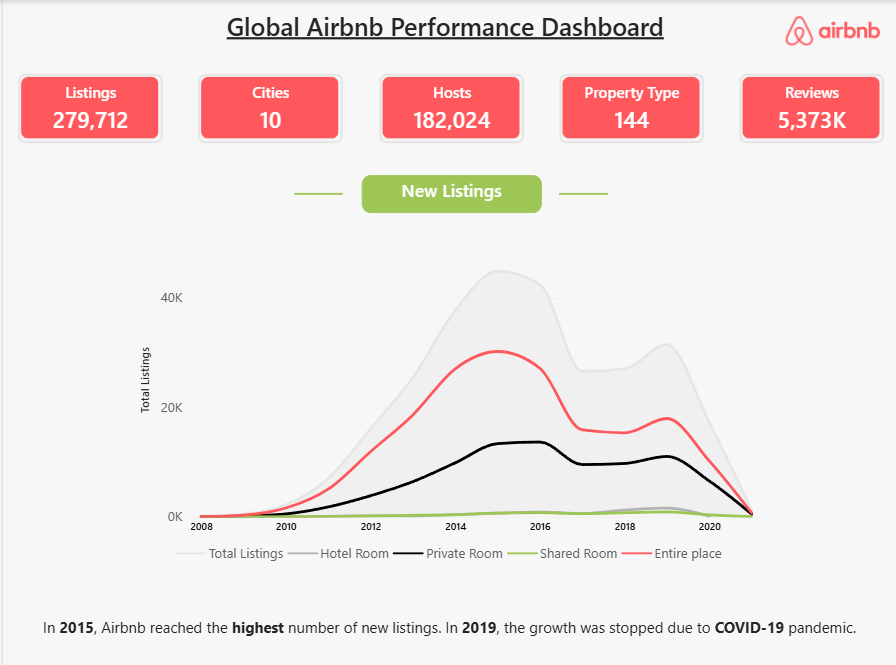
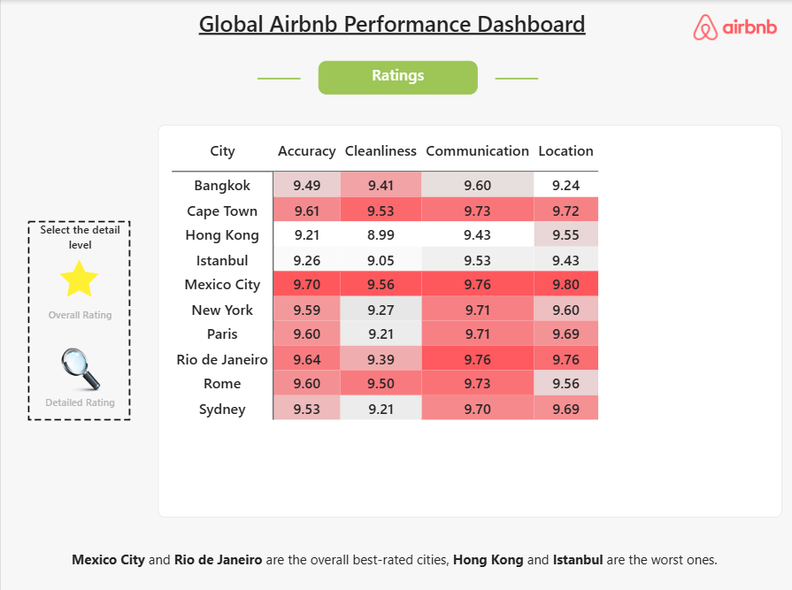

# Global Airbnb Real Estate Performance Dashboard

An interactive **Power BI dashboard** designed to analyze Airbnb performance across major cities, focusing on listings, property types, new listing trends, and customer ratings.

The project demonstrates an end-to-end **data analytics workflow**, from dataset exploration and data cleaning to data modeling, DAX measures, visualization, and dashboard storytelling.

---

## 📊 Dashboard Preview

### Overview

The Overview page provides a high-level view of Airbnb performance, including:

- Total Listings
- Number of Cities
- Number of Hosts
- Property Types
- Total Reviews
- New Listing trends by property type

---

### Ratings Analysis

The Ratings section analyzes Airbnb performance based on:

- Accuracy
- Cleanliness
- Communication
- Location
- Overall Rating

Users can switch between **Overall Rating** and **Detailed Rating** views to explore city-level performance.

---

## 🎯 Project Objective

The objective of this project was to build an interactive dashboard that answers key business questions around Airbnb's global performance.

The dashboard helps identify:

- Which cities have the highest and lowest ratings?
- How have new Airbnb listings changed over time?
- Which property types contribute most to new listings?
- Which cities perform best across detailed rating categories?
- How do cities compare based on overall customer satisfaction?

---

## 📂 Dataset

The dataset used for this project is the **Airbnb Listings & Reviews** dataset from Maven Analytics Data Playground.

**Source:**  
[Airbnb Listings & Reviews Dataset – Maven Analytics](https://mavenanalytics.io/data-playground/airbnb-listings-reviews)

The dataset contains information related to Airbnb listings, hosts, property types, reviews, ratings, locations, and other listing attributes.

## 👤 Author

**Komail Butt**

[LinkedIn](https://linkedin.com/in/komail-butt) · [Portfolio](https://komailbutt.github.io/)
